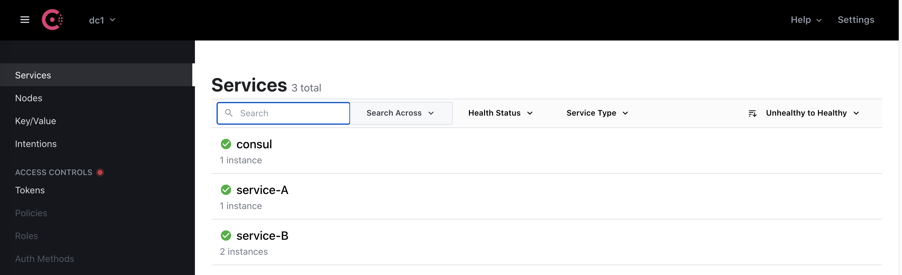

The example project for StringBoot service

<div align="center">
    
</div>

## Getting Started

## Project structure
```
.
├── service-A
│   ├── Dockerfile
│   ...
├── service-B
│   ├── Dockerfile
│   ...
├── infrastucture
│   ├── docker-compose.yaml
│   ...
├── docker-compose.yaml
|
└── README.md
```

## Prerequisites
- Make sure that you have Docker and Docker Compose installed
  - Windows or macOS:
    [Install Docker Desktop](https://www.docker.com/get-started)
  - Linux: [Install Docker](https://www.docker.com/get-started) and then
    [Docker Compose](https://github.com/docker/compose)

## Start infrastructure

```shell script
$ cd infrastructure
$ docker-compose up -d
```

## Start services
### Start services in local

- Build & start service-A

```shell script
$ cd service-A
$ ../mvnw clean package
$ ../mvnw spring-boot:run
...
```

- Build & start service-B

```shell script
$ cd service-B
$ ../mvnw clean package
$ ../mvnw spring-boot:run
...
```

Edit port and start instance 2

Log registering service

```text
2021-12-02 14:29:52.997  INFO 4178 --- [           main] o.s.c.c.s.ConsulServiceRegistry          : Registering service with consul: NewService{id='service-B-8082-192-168-1-3', name='service-B', tags=[], address='192.168.1.3', meta={secure=false}, port=8082, enableTagOverride=null, check=Check{script='null', dockerContainerID='null', shell='null', interval='10s', ttl='null', http='http://192.168.1.3:8082/actuator/health', method='null', header={}, tcp='null', timeout='null', deregisterCriticalServiceAfter='1m', tlsSkipVerify=null, status='null', grpc='null', grpcUseTLS=null}, checks=null}
```

### Start services in docker 

```shell script
$ docker-compose up -d --scale service-b=2
```

## Monitor service 

- Open Consul admin http://localhost:8500/ui/dc1/services

<div align="center">
    
</div>

## Run testing

```shell script
curl http://localhost:8081/greeta/1
```

## Stop project

- Kill project if start in local mode

- Stop infrastructure container

```shell script
$ cd infrastructure
$ docker-compose down
```

- Stop service containers

```shell script
$ docker-compose down
```

## Contribute

## Reference
- https://cloud.spring.io/spring-cloud-consul/reference/html/appendix.html#common-application-properties
- https://programmer.ink/think/use-consul-to-implement-service-discovery-instance-id-customization-3-ways.html
- https://piotrminkowski.com/2019/11/06/microservices-with-spring-boot-spring-cloud-gateway-and-consul-cluster/
- https://www.baeldung.com/spring-cloud-consul
- https://github.com/yidongnan/spring-cloud-netflix-example
- https://piotrminkowski.com/2019/11/06/microservices-with-spring-boot-spring-cloud-gateway-and-consul-cluster/
- https://github.com/hashicorp/learn-consul-docker/tree/main/datacenter-deploy-service-discovery